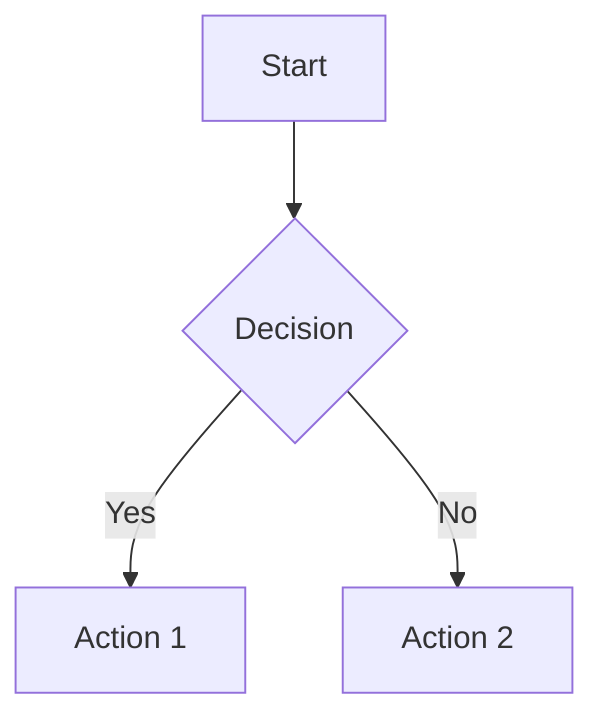

Sure! Here's a blog post designed to test LaTeX rendering within a markdown or blogging environment:

---

# Testing LaTeX Rendering in Blog Posts

Mathematics is a core part of many technical blogs—especially those focused on programming, data science, AI, physics, and finance. To write equations cleanly and understandably, **LaTeX** is the gold standard. This post demonstrates various LaTeX expressions and how they render in a blogging environment.

---

## 📐 Basic Inline Math

Inline equations are embedded within text using single dollar signs: `$...$`.

Example: The quadratic formula is given by
\$x = &amp;bsol;frac&lbrace;-b &amp;bsol;pm &amp;bsol;sqrt&lbrace;b^2 - 4ac&rbrace;&rbrace;&lbrace;2a&rbrace;\$

You can mix it with normal text like this:
"Let \$a = 2\$, \$b = -4\$, and \$c = -6\$."

---

## 🧮 Display Equations

Block-level math is rendered using double dollar signs: `$$...$$`.

Example:

$$
x = \frac{-b \pm \sqrt{b^2 - 4ac}}{2a}
$$

Here’s an integral:

$$
\int_0^\infty e^{-x} \, dx = 1
$$

And a summation:

$$
\sum_{i=1}^n i = \frac{n(n+1)}{2}
$$

---

## 📊 Matrices

LaTeX makes it easy to represent matrices:

$$
A = \begin{bmatrix}
1 & 2 & 3 \\
4 & 5 & 6 \\
7 & 8 & 9
\end{bmatrix}
$$

---

## 🧠 Useful Expressions for Developers & Scientists

**Bayes’ Theorem:**

$$
P(A|B) = \frac{P(B|A) \cdot P(A)}{P(B)}
$$

**Gradient Descent Update Rule:**

$$
\theta := \theta - \alpha \cdot \nabla J(\theta)
$$

**Einstein’s Mass–Energy Equivalence:**

$$
E = mc^2
$$

---

## 📌 Tips for Using LaTeX in Blogs

* Always check if your platform supports MathJax or KaTeX.
* Escape underscores and backslashes in Markdown.
* Prefer block math for clarity when displaying longer formulas.

---

## ✅ Final Test

Let’s finish with something complex:

$$
\frac{d}{dx} \left( \int_{0}^{x} e^{-t^2} \, dt \right) = e^{-x^2}
$$

If you see all the above formulas rendered beautifully, your LaTeX integration is working perfectly! 🎉

---

**Want to embed LaTeX into your blog?** Try tools like:

* [KaTeX](https://katex.org/)
* [MathJax](https://www.mathjax.org/)
* Static site generators with LaTeX plugins (e.g., Jekyll, Hugo)

Let me know if you want a working blog template with full LaTeX support!

[attachment:/assets/attachments/test.pdf:Test PDF Document]
[attachment:/assets/img/covers/cover.webp:Image test]
