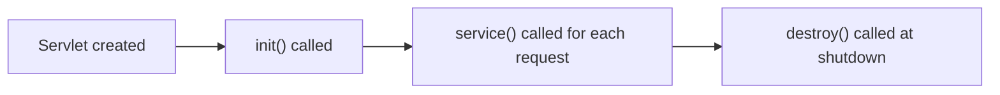

 

**1. What is a Servlet?  
Explain the basics of a web application and how servlets function within Java-enabled web servers.**

A **Servlet** is a Java programming language class used to extend the capabilities of servers that host applications accessed by means of a request-response model. Servlets are commonly used to create dynamic web applications.

- **Web Application Basics:**  
  A web application is a collection of dynamic resources (such as servlets, JavaServer Pages) and static resources (HTML, CSS, JavaScript) that together provide interactive functionalities over the web. Web applications run on web servers and are accessed via browsers by clients.

- **How Servlets Work:**  
  - When a client (browser) sends a request, the server forwards it to the servlet.
  - The servlet processes the request, interacts with databases if needed, and generates a response (usually HTML).
  - This response is sent back to the client via the web server.

 

**2. Describe the Servlet Lifecycle.  
Explain the stages of a Servlet’s lifecycle with the help of appropriate methods and flow.**

The **Servlet Lifecycle** consists of the following main stages:

1. **Loading and Instantiation:**  
   The servlet class is loaded into memory and an instance is created.

2. **Initialization (init()):**  
   The `init()` method initializes the servlet. Called once, when the servlet is first loaded.

3. **Request Handling (service()):**  
   The `service()` method handles requests from clients (e.g., HTTP requests). Called each time the servlet is accessed.

4. **Destruction (destroy()):**  
   The `destroy()` method allows the servlet to release resources before being destroyed. Called only once, just before the servlet is removed from service.

**Lifecycle Flow:**

1. Servlet created 
2. `init()` called 
3. For each request: `service()` called 
4. Upon shutdown/removal: `destroy()` called



**3. Discuss the init(), service(), and destroy() methods in detail.  
How do these methods work within the Servlet lifecycle? Give relevant code examples.**

- **init():**
  - Called once when the servlet is first loaded.
  - Used for one-time initializations (such as setting up resources).

    ```JAVA
  public void init(ServletConfig config) throws ServletException {
      super.init(config);
      // Initialization code
  }
  ```

- **service():**
  - Called by the server to handle client requests.
  - Delegates requests to doGet(), doPost(), etc. based on HTTP method.

    ```JAVA
  public void service(ServletRequest req, ServletResponse res) throws ServletException, IOException {
      // Request processing code
  }
  // For HttpServlet:
  protected void doGet(HttpServletRequest req, HttpServletResponse res) { ... }
  protected void doPost(HttpServletRequest req, HttpServletResponse res) { ... }
  ```

- **destroy():**
  - Called before the servlet instance is removed.
  - Used to release resources (e.g., close database connections).

    ```JAVA
  public void destroy() {
      // Cleanup code
  }
  ```

 

**4. What is the Servlet API?  
Describe the purpose and components of javax.servlet and javax.servlet.http packages.**

- **Servlet API:**  
  It provides interfaces and classes to write servlets. The API defines the contract between the servlet and the container (i.e., web server).

- **javax.servlet package:**  
  - Core classes and interfaces (Servlet, ServletRequest, ServletResponse, etc.)
  - Used for generic (protocol-independent) servlet functionality.

- **javax.servlet.http package:**  
  - Extends `javax.servlet` for HTTP protocol support.
  - Classes/interfaces like HttpServlet, HttpServletRequest, HttpServletResponse, HttpSession.

 

**5. Explain how to use Annotations in Servlets.  
How does @WebServlet simplify servlet configuration? Provide examples.**

**Annotations** in servlets replace the need for servlet declarations in web.xml. The `@WebServlet` annotation is used to declare a servlet.

- **Example:**

   ```JAVA
  import javax.servlet.annotation.WebServlet;
  import javax.servlet.http.HttpServlet;

  @WebServlet("/example")
  public class ExampleServlet extends HttpServlet {
      // Servlet code
  }
  ```

With `@WebServlet`, mapping is done directly in the code, making configuration simpler and easier to maintain.

 

**6. Differentiate between ServletConfig and ServletContext.  
Explain their purposes, methods, and differences using examples.**

| Feature       | ServletConfig                                           | ServletContext                          |
|---------------|--------------------------------------------------------|-----------------------------------------|
| Scope         | Per Servlet                                            | Entire Application                      |
| Used for      | Initialization parameters for a specific servlet       | Application-wide parameters/resources   |
| Lifetime      | Created per servlet instance                           | Exists as long as application lives     |
| Accessed by   | getServletConfig()                                     | getServletContext()                     |

- **Example:**

   ```JAVA
  // Using ServletConfig
  String param = config.getInitParameter("param1");

  // Using ServletContext
  ServletContext context = getServletContext();
  String appParam = context.getInitParameter("globalParam");
  ```

 

**7. Describe Session Tracking in Servlets.  
What is session tracking and what are the different techniques used in Java Servlets?**

- **Session tracking** is a mechanism to maintain state (data) about a series of requests from the same user (client) across multiple HTTP requests (HTTP is stateless).
- **Techniques for session tracking:**
  - **Cookies:** Small data sent from server to client, stored in browser.
  - **URL Rewriting:** Session ID appended to URL as a parameter.
  - **Hidden Form Fields:** Session data stored as invisible fields in forms.
  - **HttpSession:** Server maintains object per user to store data across sessions.

**Example using HttpSession:**

 ```JAVA
HttpSession session = request.getSession();
session.setAttribute("username", "JohnDoe");
```


<div class="newtopic"></div>

# Assignment - 3

**1. What is JSP (Java Server Pages)?
Explain its features and why it is more advantageous than Servlets.**

**JSP** is a technology used for developing dynamic web pages based on HTML, XML, or other document types. It allows embedding Java code into HTML pages using special JSP tags.

**Features:**

- Easy integration with HTML/XML.
- Supports Java code through expressions, scriptlets, and declarations.
- Built-in support for session management and JavaBeans.
- Can reuse components like servlets, beans, and custom tags.
- Platform-independent and scalable.

**Advantages over Servlets:**

- Easier presentation logic (can directly use HTML with embedded Java, instead of writing entire content in Java).
- Quicker development and maintenance.
- Code separation: UI in JSP, business logic in Java classes/beans/servlets.
- Reduces code complexity for dynamic web pages.


**2. Describe the JSP Architecture.
Explain the three-layer architecture and the steps involved in JSP request processing.**

**JSP Architecture** typically follows a three-layer model:

1. **Presentation Layer:** JSP pages, HTML, CSS – handles user interface.
2. **Business Logic Layer:** JavaBeans, EJBs, servlets – processes user requests and executes the core business logic.
3. **Data Layer:** Databases, data sources – stores and manages data.

**JSP Request Processing Steps:**

1. Client sends HTTP request to the server.
2. Server identifies the JSP page and passes the request to the JSP engine.
3. JSP engine translates the JSP page into a servlet (if not already compiled).
4. Servlet is compiled and executed, generating dynamic content.
5. Response (HTML) is sent back to the client browser.

 

**3. What are the phases of the JSP Lifecycle?
Discuss the steps from translation to destruction of a JSP page with relevant examples.**

**JSP Lifecycle Phases:**

1. **Translation Phase:**
JSP page is converted into a servlet source file.
2. **Compilation Phase:**
The servlet source file is compiled into a .class file.
3. **Loading and Instantiation:**
The servlet class is loaded and an instance is created.
4. **Initialization (jspInit()):**
The container invokes jspInit() for one-time initializations.
5. **Request Processing (_jspService()):**
For each request, _jspService() is called to generate the response.
6. **Destruction (jspDestroy()):**
jspDestroy() is invoked when the JSP is destroyed, for cleanup tasks.

**Example:**
When you load a `home.jsp` page for the first time:

- The server translates it into `home_jsp.java`.
- Compiles it, loads the class, calls `jspInit()`.
- Handles user requests by calling `_jspService()`.
- Calls `jspDestroy()` when the page is removed.

 

**4. Explain the role of jspInit(), _jspService(), and jspDestroy() methods.
How are these methods managed by the JSP container?**

- **jspInit():**
Called once when the JSP page is instantiated. Used for initializing resources.

 ```JAVA
public void jspInit() {
    // Initialization code
}
```

- **_jspService():**
Handles HTTP requests and generates dynamic responses. Called for every client request.

 ```JAVA
public void _jspService(HttpServletRequest request, HttpServletResponse response) {
    // Request processing code
}
```

- **jspDestroy():**
Called once when the JSP page is about to be destroyed. Used for releasing resources.

 ```JAVA
public void jspDestroy() {
    // Cleanup code
}
```


**Management:**
These methods are auto-managed by the JSP container—you don’t call them directly.

 

**5. What are the different types of JSP elements?
Describe expressions, scriptlets, directives, and declarations with syntax and examples.**

- **Expressions:**
Outputs the result of a Java expression.

 ```JSP
<%= expression %>
```

Example:
`<%= new java.util.Date() %>`
- **Scriptlets:**
Contains Java code to be executed.

 ```JSP
<% code %>
```

Example:
`<% int x = 10; %>`
- **Declarations:**
Declare variables or methods accessible to the entire JSP.

 ```JSP
<%! declaration %>
```

Example:
`<%! int counter = 0; %>`
- **Directives:**
Provide directions to the JSP container (such as page settings or includes).

 ```JSP
<%@ directive attribute="value" %>
```

Example:
`<%@ page language="java" %>`

 

**6. Compare JSP with Servlets.
How does JSP simplify web development compared to Servlets?**


| Aspect | Servlet | JSP |
| :-- | :-- | :-- |
| Syntax | Pure Java code | Mixture of HTML and Java |
| Presentation | Difficult for UI generation | Easy, as UI is written in regular HTML |
| Updates | Requires recompiling Java source | Usually only editing JSP file needed |
| Use Case | Business logic, complex processing | UI, page layout, simpler logic |

**Simplification:**
JSP allows embedding Java in HTML, making it much easier for web designers to work on presentation separately from server-side logic.

**7. How does JSP support dynamic content generation?
Discuss how JSP handles user requests and responds with customized content.**

- **Dynamic Content Support:**
JSP can embed Java code directly within HTML to generate dynamic personalizations (greetings, user data, etc.).
- **How It Works:**
    - User request is sent to JSP page.
    - The page can use request, session, application objects to read user data.
    - Embedded Java code and expressions modify the HTML output based on logic and data.
    - JSP sends back a customized response (e.g., “Hello, Alice!”).

**Example:**

```JSP
Hello, <%= request.getParameter("username") %>!
```

This will greet the specific user whose name was passed in the request.

 

If you need an explanation in bullet points, a summary sheet, or further descriptions on any answer, let me know!


<div style="text-align: center">⁂</div>
