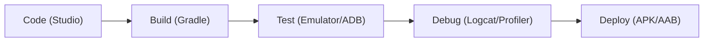
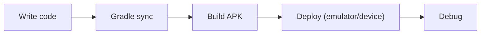

[attachment:https://static-materio.vercel.app/common/files/attach/4f3001a2-d238-44ff-8108-afb6651fb90c.pdf:Introduction to Android OS]

Android is a mobile operating system that powers most of today’s smartphones and many other smart devices, built mainly for touchscreens and developed by Google using open‑source technologies. It provides the basic “brain” that lets apps run, manages hardware like camera and sensors, and gives the familiar home screen, notifications, and settings you use every day.

## What Android Actually Is

*   **Linux-based OS**: Android sits between your device’s hardware (CPU, memory, sensors) and your apps, controlling how everything works together. It uses a modified Linux kernel plus additional Android‑specific components to handle tasks such as memory management, security, networking, and power efficiently on mobile devices.
*   **Open Source**: Phone companies and developers are allowed to view, modify, and adapt the system to their own devices and needs. On top of this core system, Google adds its own services (like Play Store and Google apps), which many manufacturers bundle on their phones and tablets.

## Where Android Is Used

*   **Diverse Devices**: Although Android started for smartphones, it now powers a wide range of devices such as tablets, smart TVs, car systems (Android Auto), and smartwatches (Wear OS). Variants and custom builds also appear in devices like game consoles, cameras, home automation systems, and other consumer electronics.
*   **User Interface**: A typical Android device gives users a graphical interface with a home screen, app drawer, status bar, and built‑in apps like phone, messages, browser, and camera. Users can install extra apps from stores like Google Play, enabling everything from social media and banking to games and learning tools.

## Why Android Became Popular

*   **Flexibility & Cost**: Android became the most widely used mobile OS because it is free for manufacturers, customizable, and runs on hardware from many brands and price ranges. This flexibility helped create a huge ecosystem of devices and a very large app market, attracting both users and developers worldwide.
*   **Educational Value**: For students, learning Android matters because it combines core CS concepts (OS, Java/Kotlin, Linux) with practical app development that directly reaches millions of users. Understanding the basics now makes advanced topics like Android architecture and version features much easier to grasp later.


## Android Architecture

Android architecture describes how the Android system is organized in layers, from low-level hardware control at the bottom to the apps you use at the top. Understanding this layered structure helps in designing apps that are efficient, secure, and easy to maintain.

### Big Picture: Layered Stack

Android is usually shown as a “stack” of layers: Linux kernel at the bottom, then native/Platform libraries and Android Runtime, then the Application Framework, and finally user Applications at the top. Each upper layer uses services provided by the layers below it instead of talking directly to the hardware, which keeps the system modular and easier to manage.


### Android architecture layers

| Layer (Top → Bottom) | Simple idea | What it mainly does |
| --- | --- | --- |
| Applications | Apps you install and use | Provide features like chat, games, banking using system APIs. |
| Application Framework | “Toolbox” for app developers | Manages activities, notifications, resources, windows, etc., offering high‑level APIs to apps. |
| Android Runtime | Engine that runs app code | Includes core libraries and the virtual machine (Dalvik/ART) that executes app bytecode efficiently. |
| Native/Platform Libraries | Heavy‑duty helpers | C/C++ libraries for graphics (OpenGL), database (SQLite), web, media, and more. |
| Linux Kernel | Core OS and hardware layer | Handles drivers, memory, processes, power, and basic security; talks to actual hardware. |

####  Linux Kernel Layer

The Linux kernel is the foundation of Android, responsible for process management, memory management, power control, and hardware drivers like display, camera, audio, and Bluetooth. It also provides a security boundary and a hardware abstraction so upper layers do not need to know exact hardware details.

####  Libraries And Android Runtime

Above the kernel are native libraries (often in C/C++) that implement important services like graphics rendering, media playback, web browsing, and local databases. Alongside them is the Android Runtime, which includes core libraries plus the virtual machine (historically Dalvik, now ART) that executes app code written in Java/Kotlin in an optimized way.

####  Application Framework

The Application Framework exposes ready‑made building blocks that developers use instead of dealing with low‑level details. Key parts include managers for activities (screens), windows, notifications, content providers, and the view system (buttons, text fields, layouts).

####  Applications Layer

At the top sit system apps (Phone, Messages, Settings) and third‑party apps that you install from app stores. These apps run inside the framework/runtime environment and interact with the device only through the framework APIs, which keeps the system more secure and consistent across different devices.

### How To Remember The Architecture

A handy memory trick is: “Kids Love Real Fun Apps” → Kernel, Libraries, Runtime, Framework, Applications, going bottom to top. You can also imagine a burger: bun (apps), sauces/veggies (framework), patty (runtime and libraries), and plate (kernel) holding everything from below


## Android Versions
From the very first release up to Android 16, including dessert codenames (public and internal) where applicable, and the API level for quick reference.

## Android Versions: 1.0 to 16 (Evolution Story)

Android started as a bare-bones OS in 2005 and evolved into a powerhouse platform by Android 16. Here's the complete timeline with what each era offered.

```mermaid
%%{init: { "flowchart": { "ranksep": 200 } }}%%
flowchart LR
    %% Era styling
    classDef era fill:#f8f9fa,stroke:#333,stroke-width:1px,font-weight:bold;
    classDef version fill:#e6f2ff,stroke:#1f6feb,stroke-width:1px;

    subgraph Early["Early Versions (2008–2010)"]
      direction LR
      v1["2008<br/>1.0 / 1.1<br/>(Basic)"] --> v1_5["2009<br/>1.5<br/>Cupcake"]
      v1_5 --> v1_6["2009<br/>1.6<br/>Donut"]
      v1_6 --> v2_0["2009<br/>2.0<br/>Eclair"]
      v2_0 --> v2_2["2010<br/>2.2<br/>Froyo"]
      v2_2 --> v2_3["2010<br/>2.3<br/>Gingerbread"]
    end

    subgraph Tablet["Tablet Era and Modernization (2011–2019)"]
      direction LR
      v3_0["2011<br/>3.0<br/>Honeycomb"] --> v4_0["2011<br/>4.0<br/>ICS"]
      v4_0 --> v4_4["2013<br/>4.4<br/>KitKat"]
      v4_4 --> v5_0["2014<br/>5.0<br/>Lollipop"]
      v5_0 --> v7_0["2016<br/>7.0<br/>Nougat"]
    end

    subgraph Numeric["Numeric Era (2019–2025)"]
      direction LR
      v10["2019<br/>10"] --> v16["2025<br/>16<br/>Baklava"]
    end

    %% Connect eras
    v2_3 --> v3_0
    v7_0 --> v10

    %% apply node class
    class v1,v1_5,v1_6,v2_0,v2_2,v2_3,v3_0,v4_0,v4_4,v5_0,v7_0,v10,v16 version;

```



### Early Versions (1.0-2.3): Bare Essentials (2008-2010)

**Android 1.0/1.1 (2008)**: First release on HTC Dream (T-Mobile G1). Offered basic phone calls, SMS, browser, contacts, and calendar. No app store yet—apps sideloaded via APK. Touchscreen support was primitive, no multi-touch.

**Cupcake (1.5, 2009)**: First major update. Added on-screen keyboard, widgets, video recording, auto-rotation. HTC Hero shipped with it—first "smart" Android feel.

**Donut (1.6)** & **Eclair (2.0-2.1)**: Voice search, live wallpapers, multiple accounts, Bluetooth 2.1. Nexus One (Google's first phone) ran Eclair.

**Froyo (2.2)** & **Gingerbread (2.3)**: Flash support, hotspot tethering, better battery, NFC intro. Gingerbread polished UI—most successful early version.

**What they offered**: Basic telephony + internet. No Play Store (Market existed), clunky UI, single-tasking, poor battery life. ~10% market share vs Symbian.

### Tablet Era & Modernization (3.0-9): Growing Up (2011-2019)

**Honeycomb (3.0)**: First tablet-optimized (Motorola Xoom). Holographic UI, multi-tasking, hardware acceleration.

**Ice Cream Sandwich (4.0)**: Unified phone/tablet UI, Face Unlock, data usage tracking. Galaxy Nexus launched Android's "robot" era.

**Jelly Bean (4.1-4.3)**: Google Now, Project Butter (smooth 60fps), expandable notifications.

**KitKat (4.4)**: "Hangouts" integration, immersive mode, OK Google voice commands. Ran on 512MB RAM devices.

**Lollipop (5.0)**: Material Design, ART runtime (faster apps), notifications shade, Doze battery saving.

**Marshmallow-Nougat-Oreo-Pie (6-9)**: Doze, split-screen, fingerprint API, Picture-in-Picture, adaptive brightness, gesture navigation.

### Numeric Era (10-16): Enterprise Powerhouse (2019-2025)

**Android 10+**: Dropped desserts publicly (internal: Quince Tart→Baklava). Privacy dashboard, scoped storage, foldable support, 5G, desktop mode.

**What Android 16 offers now**: AI-first (on-device Gemini), 120Hz adaptive refresh, satellite connectivity, advanced privacy (Private Space), Material You 3.0, foldable/AR/VR optimization, 16GB+ RAM support.

### Then vs Now: Feature Explosion

**2008 (1.0)** → Basic phone + browser  
**2025 (16)** → AI assistant + satellite + foldables + 8GB RAM gaming

> [!NOTE] Dessert names stopped being used publicly from Android 10, but Google still uses internal dessert codenames; these are included.

### Android versions 1.0 to 16

| Major version | API level (main) | Codename / dessert |
| --- | --- | --- |
| Android 1.0 | 1 | No codename (initial public release) |
| Android 1.1 | 2 | No codename (sometimes called “Petit Four” internally) |
| Android 1.5 | 3 | Cupcake |
| Android 1.6 | 4 | Donut |
| Android 2.0 / 2.0.1 | 5 / 6 | Eclair |
| Android 2.1 | 7 | Eclair |
| Android 2.2.x | 8 | Froyo (Frozen Yogurt) |
| Android 2.3 – 2.3.7 | 9 / 10 | Gingerbread |
| Android 3.0 – 3.2.x | 11 / 12 / 13 | Honeycomb |
| Android 4.0.1 – 4.0.4 | 14 / 15 | Ice Cream Sandwich |
| Android 4.1 – 4.3.1 | 16 / 17 / 18 | Jelly Bean |
| Android 4.4 – 4.4W.2 | 19 / 20 | KitKat |
| Android 5.0 – 5.1.1 | 21 / 22 | Lollipop |
| Android 6.0 – 6.0.1 | 23 | Marshmallow |
| Android 7.0 – 7.1.2 | 24 / 25 | Nougat |
| Android 8.0 – 8.1 | 26 / 27 | Oreo |
| Android 9.0 | 28 | Pie |
| Android 10 | 29 | **Quince Tart** (AOSP) / **Queen Cake** (Internally) |
| Android 11 | 30 | Red Velvet Cake |
| Android 12 / 12L | 31 / 32 | Snow Cone |
| Android 13 | 33 | Tiramisu |
| Android 14 | 34 | Upside Down Cake |
| Android 15 | 35 | Vanilla Ice Cream |
| Android 16 | 36 | Baklava |


## Features

Android offers key features that make it powerful for users and developers, focusing on openness, customization, and efficiency.

### Core Platform Features

- **Open Source Nature**: Based on Linux kernel and AOSP (Android Open Source Project), allowing manufacturers to customize and developers to access source code freely.
- **Multi-tasking & App Sandboxing**: Runs multiple apps simultaneously with isolated processes for security; each app gets its own memory space to prevent crashes.
- **Rich UI Components**: Supports activities (screens), layouts (XML-based designs), fragments (modular UI), views (buttons, lists), and adaptive layouts for phones/tablets.
- **Resource Management**: Handles strings, images, dimensions via res folder; supports localization, themes, and densities for different screens.

### Developer-Friendly Tools

- **Intents System**: Messages for starting activities/services, sharing data between apps, and implicit/explicit communication.
- **Activity Lifecycle**: Methods like onCreate, onStart, onResume, onPause manage app states (visible, paused, destroyed) efficiently.
- **Services & Background Tasks**: Started/bound services for downloads/music; notifications, alarms, and JobScheduler for scheduled work.
- **Data Handling**: SQLite databases, Content Providers, SharedPreferences; adapters for lists (ArrayAdapter, CursorAdapter).

### User & Security Features

- **Permissions Model**: Runtime permissions for camera/location; app sandboxing prevents unauthorized access.
- **Google Mobile Services (GMS)**: Play Store, Maps, Gmail integration on certified devices.
- **Hardware Abstraction**: Supports diverse devices (phones, TVs, watches, cars) via HAL and drivers.


> [!TIP]   Think "O-M-R-D-U-S": **O**pen source, **M**ulti-tasking, **R**ich UI, **D**eveloper tools (Intents/Lifecycle), **U**ser security, **S**ervices/data – covers 90% of key features!


## Open Handset Alliance (OHA)
Andy Rubin, often called the "Father of Android," kickstarted the mobile revolution by founding Android Inc. in October 2003 in Palo Alto, California, alongside Rich Miner, Nick Sears, and Chris White. The goal was simple yet ambitious: build a smarter mobile OS aware of user location and preferences to challenge Symbian and Windows Mobile, but the startup quickly ran out of cash, forcing Rubin to bootstrap with friends' loans.

By 2005, with Android Inc. struggling, Google acquired it for around $50 million, bringing Rubin on board to lead mobile efforts under CEO Eric Schmidt. Rubin saw the iPhone's 2007 launch as a wake-up call—Apple controlled the ecosystem tightly. To counter this, Rubin rallied Google to create an **open alternative**. On November 5, 2007, they unveiled the **Open Handset Alliance (OHA)**, a powerhouse consortium of 34 founding members including Google, HTC, Motorola, Samsung, Qualcomm, Texas Instruments, Intel, T-Mobile, Sprint, and NVIDIA.

### The OHA Story: From Secret Startup To Open Revolution

Imagine 2007: Rubin pitches to industry giants, "Let's build the first truly open, comprehensive mobile platform—no single company owns it." Schmidt backs him publicly: "This powers thousands of phone models, not just a 'Google Phone'." The OHA committed to Android as free, Linux-based open source via AOSP, accelerating innovation while keeping costs low for consumers.

- **Founding members snapshot**: 8 device makers (HTC, Samsung, Motorola, LG), 5 chip firms (Qualcomm, TI), 3 carriers (T-Mobile, Sprint, Vodafone), plus software players.
- **First fruits**: OHA released Android SDK preview days later; HTC Dream (T-Mobile G1) launched October 2008 as the first Android phone.
- **Growth**: OHA ballooned to 84 members, banning forks of Android to keep it unified, though it's now dormant as Android dominates.


> [!TIP]  Think of OHA as Android's "Avengers team"—Rubin as Iron Man assembling rivals (HTC like Captain America, Google like Hulk) against the Symbian/iOS "Thanos" monopoly.  
> **Some Dates**:  "2003 Android born, 2005 Google adopts, 2007 OHA assembles (34 heroes)"

> [!NOTE] OHA made Android unstoppable by uniting the ecosystem around openness, powering 3.9B+ devices today (as of 2025).

## Dalvik VM

Dalvik VM was Android's original virtual machine that executed app bytecode, designed specifically for mobile devices with low memory and battery constraints.

### What Is Dalvik VM?

Dalvik is a **register-based JVM** (unlike stack-based standard Java VM) that runs Dalvik Executable (.dex) files—optimized bytecode from Java .class files compiled by the `dx` tool. Key traits:
- **DEX format**: Combines multiple .class files into one compact .dex file, reducing app size by ~50% via shared strings/methods.
- **Just-In-Time (JIT) compilation**: Converts DEX to native machine code at runtime for speed, but with warmup overhead.
- **Low memory**: Thread-shared, runs multiple processes efficiently on ARM chips; each app gets its own VM instance.


> [!TIP] Dalvik is like a "mobile translator" that converts bulky Java books (.class) into pocket dictionaries (.dex), reading them on-the-fly (JIT) instead of pre-printing (AOT).


### From Dalvik To ART (Android Runtime)

Android 5.0 (Lollipop, 2014) replaced Dalvik with **ART (Android Runtime)** using **Ahead-of-Time (AOT) compilation**. During app install, ART compiles entire DEX to native ARM code (.oat files), skipping runtime JIT.

### ART Benefits (vs Dalvik)

| Feature | Dalvik (JIT) | ART (AOT) |
| --- | --- | --- |
| **App Launch** | Slow (JIT warmup) | **2-3x faster** (pre-compiled) |
| **Battery Life** | Higher CPU during JIT | **30% better** (no runtime compilation) |
| **App Size** | Smaller DEX | Slightly larger .oat, but negligible |
| **Debugging** | Harder (JIT code) | **Better** (native symbols preserved) |
| **Memory** | High during JIT | Lower overall |

> [!TIP] "Dalvik JITs at runtime (Just-In-Time = lazy chef cooking on order), ART Ahead-of-Time (pre-cooks meals = restaurant ready)"—ART wins for speed + battery!

> [!NOTE] Dalvik enabled Android's early success on weak hardware; ART made it blazing fast for modern devices.

## Android SDK

The **Android SDK (Software Development Kit)** is the official set of tools, libraries, and documentation needed to build, test, and deploy Android apps.

### What The SDK Contains

Android Studio bundles the SDK, providing everything from APIs to emulators. Key components include:

| Component | Purpose | ple Tools |
| --- | --- | --- |
| **SDK Platforms** | APIs for specific Android versions (e.g., API 34 for Android 14) | Framework libraries, system images |
| **SDK Tools** | Build, debug, test utilities | ADB (debug bridge), AVD Manager, APK Builder |
| **Build Tools** | Compilers & packagers | dx/d8 (DEX converter), aapt (resource compiler), Gradle |
| **Documentation** | API references & guides | Offline docs, samples |
| **Emulator** | Virtual devices (AVDs) | Test on Nexus/Pixel without physical hardware |
| **Support Libraries** | Backward compatibility | AppCompat, Material Design |


> [!TIP]  SDK is your "Android workshop"—tools (hammer=ADB), materials (wood=APIs), and blueprints (docs) to build apps that run on any device.


### How Developers Use It

1. **Install via Android Studio**: Downloads SDK to `~/Android/Sdk` (auto-managed).
2. **Write code**: Java/Kotlin + XML layouts in Android Studio.
3. **Build APK**: Gradle compiles → DEX → APK (installable package).
4. **Test**: Run on emulator or device via ADB.
5. **Publish**: Sign APK → Google Play or sideload.


> [!TIP] "S**DK** = **S**tudio + **D**ebug + **K**its" (Studio IDE, Debug tools, Kit of APIs/platforms)—covers 90%!


> [!NOTE] Without SDK, no Android apps possible; it's the bridge from code to devices.


## Android Development Tools

Android development tools form the complete ecosystem for building, testing, and deploying apps, with **Android Studio** as the central IDE bundled with the SDK.

### Core Development Tools

| Tool | Purpose | Key Features |
| --- | --- | --- |
| **Android Studio** | Official IDE | Code editor, visual layout designer, Gradle integration, emulator, profiler |
| **Gradle** | Build automation | Manages dependencies, compiles APK/AAB, handles multi-module projects |
| **AVD Manager** | Android Virtual Device | Creates/runs emulators for different devices (Pixel, Nexus, tablets) |
| **ADB (Android Debug Bridge)** | Device communication | Install APKs, shell access, logcat, port forwarding |
| **APK Analyzer** | APK inspection | View app size, resources, DEX files, permissions |
| **Layout Inspector** | UI debugging | Live view hierarchy during runtime |

### Testing & Profiling Tools

- **Emulator**: Hardware-accelerated virtual devices with GPS, camera simulation
- **Logcat**: Real-time logs (verbose/debug/error) for crash analysis
- **Profiler**: CPU, memory, network, energy usage monitoring
- **Lint**: Static code analyzer for performance/security issues
- **UI Automator**: Automated black-box UI testing


> [!TIP] Think of it as a "car factory"—Studio (assembly line), Gradle (robot arms), Emulator (test track), ADB (conveyor belt), Profiler (quality control).


### Workflow Summary



> [!TIP] "**S**tudio **G**radles **A**DBs **E**mulator **P**rofiler" (S-G-A-E-P)—main tools in order!


> [!NOTE] These tools make Android development fast, visual, and device-independent.


## Android Development Environment

The **Android Development Environment** centers around **Android Studio** (official IDE) + **Android SDK** + supporting tools, providing everything needed to build apps from code to deployment.

### Detailed Setup & Components

#### 1. **Android Studio (IDE)**
- **Based on**: IntelliJ IDEA with Android plugins
- **Key panels**: Project explorer, code editor, design editor (drag-drop layouts), logcat, profiler
- **Installation**: ~1GB download, auto-installs SDK; supports Windows/Mac/Linux
- **Features**: Templates (Empty Activity, Navigation Drawer), Gradle sync, instant run, APK signing

#### 2. **Android SDK (Software Development Kit)**
- **Location**: `~/Android/Sdk` (auto-managed by Studio)
- **Components**: SDK Platforms (per API level), Build Tools (compilers), Emulator, Documentation
- **SDK Manager**: GUI to download API levels, system images, extras (Google Play Services)

#### 3. **Project Structure** (Generated by Studio)
```
MyApp/
├── app/
│   ├── src/main/
│   │   ├── java/          # Kotlin/Java code (Activities, Fragments)
│   │   ├── res/           # Resources (layouts, drawables, strings.xml)
│   │   └── AndroidManifest.xml  # App config, permissions
│   └── build.gradle       # Module dependencies
├── build.gradle           # Project-level config
└── gradle.properties      # Build settings
```


#### 4. **Emulator Setup (AVD Manager)**
- Create virtual devices (Pixel 6, Nexus 5X, tablets)
- System images per API (e.g., API 34 for Android 14)
- Hardware acceleration (HAXM/KVM) for 60fps

#### 5. **Build & Run Process**




Commands: `./gradlew assembleDebug` or Studio's "Run" button

### Development Environment Summary Table

| Component | Role | Key Files/Tools | Student Tip |
| --- | --- | --- | --- |
| **Android Studio** | IDE/Code Editor | Design editor, Logcat, Profiler | "Your Android cockpit" |
| **Android SDK** | Libraries & APIs | SDK Manager, Platforms (API 1-36) | Download only needed APIs |
| **Gradle** | Build System | build.gradle files | Handles dependencies automatically |
| **Emulator (AVD)** | Virtual Device | AVD Manager, system images | Test without physical phone |
| **ADB** | Device Bridge | adb install, logcat | Connects Studio ↔ Device |
| **Project Files** | App Structure | AndroidManifest.xml, res/, java/ | Every app needs these 3 folders |


> [!TIP] Studio = kitchen (cooking area), SDK = ingredients (APIs), Gradle = oven (cooking), Emulator = tasting table (testing).  
>  "**S**tudio **S**DK **G**radle **E**mulator** = **S**SGE** (Super Simple Game Engine)"—core 4 components!


> [!NOTE] Install Android Studio → Everything else auto-configures; ready to code in 10 minutes.


## Android Virtual Device

An **Android Virtual Device (AVD)** is a software emulator that simulates a real Android device (phone/tablet/TV) on your computer, allowing testing without physical hardware.

### What Is AVD & Why Use It?

AVD mimics complete device hardware + software:
- **Hardware**: CPU, RAM, screen size/resolution, camera, GPS, sensors
- **Software**: Specific Android version (API level), system image, Google Play Services
- **Use cases**: Test on multiple devices/configurations, debug crashes, demo apps


> [!TIP] AVD = "flight simulator" for Android—practice on virtual Pixel 10 without buying 10 phones.


### Creating An AVD (Step-By-Step)

1. **Open AVD Manager**: Tools → AVD Manager (or device icon in toolbar)
2. **Create Virtual Device** → Choose hardware (Phone → Pixel 9)
3. **Select System Image** → API 34 (Android 16), download if needed (~2GB)
4. **Configure AVD** → Name it "Pixel9_API36", enable hardware acceleration
5. **Finish** → AVD appears in list, ready to launch

```
Example: Pixel 9 AVD
├── Hardware: 6.4" 1080x2400, 8GB RAM
├── Android 16 (API 36)
├── Google APIs (Play Store optional)
└── 60fps with HAXM/KVM acceleration
```

### Running & Managing AVDs

| Action | How-To | Pro Tip |
| --- | --- | --- |
| **Launch** | Click green "Play" button in AVD Manager | Cold boot = 30s, Quick boot = 3s |
| **Install APK** | Run app from Studio (auto-deploys) or `adb install app.apk` | Wipe data for clean test |
| **Snapshots** | Save emulator state (like VM suspend) | Speed up repeated testing |
| **Hardware Acceleration** | Enable HAXM (Windows/Mac) or KVM (Linux) | 10x faster than software emulation |
| **Multiple AVDs** | Create Nexus 5X, tablets, Wear OS | Test Material You on different screens |

### AVD vs Real Device

| Aspect | AVD | Real Device |
| --- | --- | --- |
| **Speed** | Slower startup, accurate after | Instant |
| **Cost** | Free | $$$ |
| **Debugging** | Full logcat/profiler access | USB debugging needed |
| **Hardware** | Simulated GPS/camera | Real sensors |
| **Best for** | Development, multi-device testing | Performance, battery tests |


> [!TIP] "**A**PI + **V**irtual **D**evice = **A**VD** (pick right API for your target Android version)!

> [!NOTE] AVD Manager → Hardware profile → System image → Test your app on virtual Pixel without touching a phone.


## Directory Structure

The **structure of an Android application** follows a standard directory layout generated by Android Studio, organizing code, resources, and configuration into logical folders for building APKs.

### Core Project Structure

*   **Root**: At the root sits `app/src/main/` containing everything.
*   **Java/Kotlin Code**: Lives in `java/com/yourpackage/` with classes like `MainActivity.kt` extending `AppCompatActivity`. These handle logic, UI updates, and lifecycle methods like `onCreate()` where `setContentView(R.layout.activity_main)` loads the layout.
*   **Resources**: Go in `res/` split by type:
    *   `layout/` holds XML files like `activity_main.xml` defining UI with `<LinearLayout>`, `<Button>`, `<TextView>` using attributes like `android:layout_width="match_parent"`.
    *   `drawable/` stores images (`ic_launcher.png`), colors (`colors.xml`), and vectors.
    *   `values/` has `strings.xml` (`<string name="app_name">MyApp</string>`), `dimens.xml` for padding/spacing, and `styles.xml` for themes.

### Essential Configuration Files

*   **AndroidManifest.xml**: The app's blueprint, declaring activities (`<activity android:name=".MainActivity">`), permissions (`<uses-permission android:name="android.permission.INTERNET"/>`), intent filters for launcher icon, and SDK versions (`minSdkVersion="21"`). It tells Android what the app contains and needs.
*   **Build Configuration**: Splits across `build.gradle` files:
    *   **Project-level**: Handles plugins/dependencies like `implementation 'androidx.appcompat:appcompat:1.6.1'`.
    *   **App-level**: Defines `compileSdk 34`, signing configs, and ProGuard rules. Gradle syncs everything to generate R.java for resource IDs (`R.layout.activity_main`).

### Building The APK

When you hit "Build," Gradle compiles Java/Kotlin to DEX bytecode, packages resources via AAPT into `classes.dex`, zips everything into APK with signing. The final `app-debug.apk` (or release-signed) contains Manifest, DEX, resources.arsc, and assets—ready for devices/emulators.


> [!TIP] App structure = recipe book: Manifest (cover/table of contents), Java (cooking instructions), res/ (ingredients list with photos), build.gradle (oven settings).  
>  "**M**anifest **C**ode **R**esources **B**uild = **MCRB** (My Code Runs Beautifully)"—core 4 pillars!


> [!NOTE] Every Android app = Manifest (what) + Code (how) + Resources (looks) + Gradle (builds).


```
Android Application Structure 
==================================================

MyFirstApp/                           <- Root Project
├── build.gradle                     <- Project-level build config
├── gradle/
│   └── wrapper/                     <- Gradle wrapper
└── app/                             <- Main module
    ├── build.gradle                 <- Module-level dependencies
    ├── src/
    │   └── main/
    │       ├── AndroidManifest.xml  <- App blueprint (Activities, Permissions)
    │       ├── java/
    │       │   └── com/example/app/
    │       │       ├── MainActivity.java     <- UI Logic
    │       │       ├── MyFragment.java       <- Modular UI
    │       │       └── utils/Helper.java     <- Custom classes
    │       └── res/                      <- ALL UI & Assets
    │           ├── layout/
    │           │   ├── activity_main.xml   <- Screen 1 (LinearLayout + Button)
    │           │   └── fragment_detail.xml <- Screen 2
    │           ├── values/
    │           │   ├── strings.xml         <- "Hello World!" (localizable)
    │           │   ├── colors.xml          <- #FF0000 (red)
    │           │   └── dimens.xml          <- 16dp padding
    │           ├── drawable/
    │           │   ├── ic_launcher.png     <- App icon
    │           │   └── bg_gradient.xml     <- Background
    │           └── mipmap-*/              <- Density-specific icons
    └── build/                           <- AUTO-GENERATED
        └── outputs/
            └── apk/
                └── app-debug.apk      <- INSTALLABLE APP!

Build Flow:
Java/Kotlin + XML ──(Gradle)──> DEX ──(ART)──> APK ──(ADB)──> Device/Emulator
```

**Key Folders Explained:**
```
CRITICAL 3: Every app MUST have these
├── AndroidManifest.xml  (Permissions + Activities)
├── java/               (Your code logic)
└── res/layout/         (Your screens/UI)

RES FAMILY: UI customization
└── res/
    ├── values/     (Text, colors, sizes)
    ├── drawable/   (Images, shapes)
    └── layout/     (Screens)
```


> [!TIP] Blueprint (Manifest) + Bricks (java/) + Paint/Furniture (res/) = House (APK)!  
>  "**M**anifest **J**ava **R**es = **MJ**R** (Major folders = 3 only)!


## Manifest Files

The **AndroidManifest.xml** is the core configuration file of every Android app, acting as its "blueprint" that tells the Android system exactly what the app contains, its capabilities, and how it should behave.

### What It Declares

*   **Activities**: Every `<activity>` in your app must be registered here with `<activity android:name=".MainActivity">`, including the launcher activity via `<intent-filter>` with `<action android:name="android.intent.action.MAIN"/>` and `<category android:name="android.intent.LAUNCHER"/>`—this creates the app icon on the home screen.
*   **Other Components**: Services, broadcast receivers, and content providers get similar declarations like `<service android:name=".MyService"/>`.
*   **Permissions**: Requested with `<uses-permission android:name="android.permission.INTERNET"/>` or `<uses-permission android:name="android.permission.CAMERA"/>`.
*   **Hardware Features**: Like `<uses-feature android:name="android.hardware.camera" android:required="true"/>` ensure the app only installs on compatible devices.

### SDK & App Config

*   **SDK Compatibility**: Specifies `<uses-sdk android:minSdkVersion="21" android:targetSdkVersion="34" android:compileSdkVersion="34"/>`—minSdk is the oldest Android version supported, targetSdk ensures modern behavior.
*   **App Identity**: Comes from `<application android:label="@string/app_name" android:icon="@mipmap/ic_launcher" android:theme="@style/AppTheme">`, setting name, icon, and default theme.

### Security & Launch Control

*   **Security**: The manifest enforces security by declaring exported components (`android:exported="true"`) and defining custom permissions (`<permission android:name="com.example.MY_PERMISSION"/>`).
*   **Launch Control**: It also controls launch modes (`android:launchMode="singleTop"`) and screen orientation (`android:screenOrientation="portrait"`).


> [!TIP] Manifest = "passport" for your app—name (label), photo (icon), permissions (visa stamps), activities (travel destinations), SDK requirements (validity dates).


### Example Skeleton
```xml
<manifest xmlns:android="http://schemas.android.com/apk/res/android">
    <uses-permission android:name="android.permission.INTERNET" />
    
    <application android:label="@string/app_name" android:icon="@mipmap/ic_launcher">
        <activity android:name=".MainActivity"
                  android:exported="true">
            <intent-filter>
                <action android:name="android.intent.action.MAIN" />
                <category android:name="android.intent.LAUNCHER" />
            </intent-filter>
        </activity>
    </application>
</manifest>
```


> [!TIP] "**A**ctivities **P**ermissions **S**DK **A**pplication = **APSA** (App's Passport Security Authority)"—4 main sections!

> [!NOTE] No manifest = Android ignores your app completely; it's the first file system reads.
